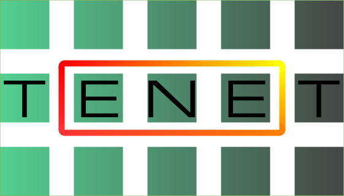
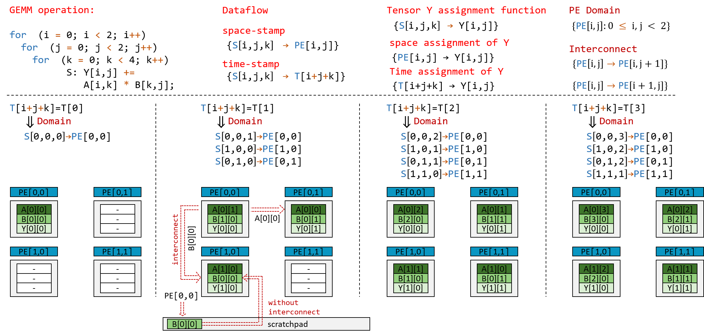

<div align="center">
  
</div>

# TENET: A Framework for Modeling Tensor Dataflow Based on Relation-centric Notation

TENET is an analytical framework that models hardware dataflow of tensor applications on spatial architectures. By using the relation-centric notation to represent dataflow, interconnection and tensor operations uniformly, TENET support a wide range of dataflows and enables specification of spatial architecture interconnection. TENET also provide analysis for critical performance metrics, such as data reuse, PE utilization, latency and energy.

## What is Relation-centric Notation?



As shown in Figure above, the relation-centric notation use integer relations to uniformly represent dataflow, interconnection and tensor operations. The dataflow assigns a multi-dimensional time-stamp to each instance specifying its execution order, and a multi-dimensional space-stamp to each instance specifying its execution place (PE coordinates). The interconnection specifies which PE are connected by network-on-chip. We currently support several interconnections including 1D systolic, 2D systolic and mesh structure. The Tensor operation specifies the iteration domain and access function.

## Requirements

TENET leverage the [Integer Set Library](http://isl.gforge.inria.fr/) and the [Barvinok Library](http://barvinok.gforge.inria.fr/) to perform metrics analysis. To install required libraries, run our prepared script file [init.sh](init.sh).
(You can also follow the instructions [here](https://repo.or.cz/w/barvinok.git/blob/HEAD:/README), but make sure to set `[project_path]/external/` as install location. 

## Project Structure
The header and source files of TENET core framework are located in `include/` and `src/`, respectively.   
Experiment data of [our paper](#paper) is located in `data/`.  
Experiment codes are located in `test/`.
## Installation

To install TENET, use the following command:

```
make clean
make all \
MAIN=[entry file name] #the file should be placed under test/ directory \
TARGET=[target executable]
```
After the build, the object files are stored in `build/`, while target executables in `bin`.
```
bin/[executable]
```
## Example
commands below reproduce AlexNet reuse factor experiment of our paper.
```
make clean
make all MAIN=main.cpp TARGET=alexnet_layers
bin/alexnet_layers
```
## Papers
<span id="paper"></span>
 If you find this project useful in your research, please cite our paper that has been recently accepted to ISCA 2021:

    @inproceedings{lu2021tenet,
      title={TENET: A Framework for Modeling Tensor Dataflow Based on Relation-centric Notation},
      author={Lu, Liqiang and Guan, Naiqing and Wang, Yuyue and Jia, Liancheng and Luo, Zizhang and Yin, Jieming and Cong, Jason and Liang, Yun},
      booktitle={2021 ACM/IEEE 48rd Annual International Symposium on Computer Architecture (ISCA)},
      year={2021}
    }