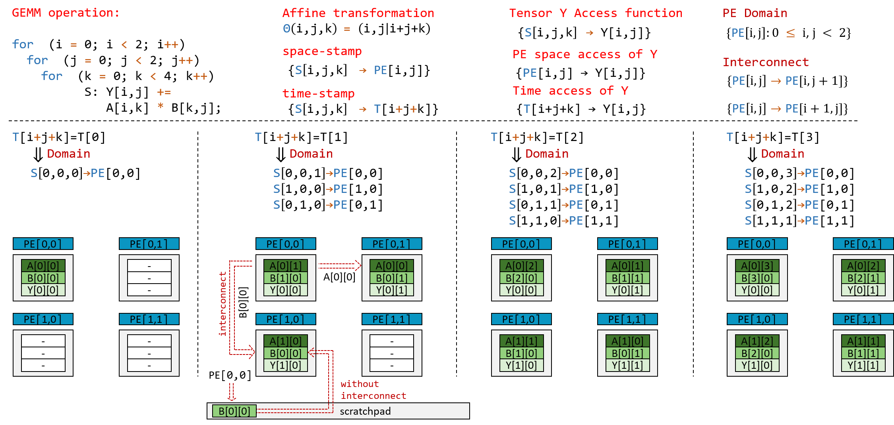

# TENET: A Framework for Modeling Tensor Dataflow Based on Relation-centric Notation

TENET is an analytical framework that models hardware dataflow of tensor applications on spatial architectures. By using the relation-centric notation to represent dataflow, interconnection and tensor operations uniformly, TENET support a wide range of dataflows and enables specification of spatial architecture interconnection. TENET also provide analysis for critical performance metrics, such as data reuse, PE utilization, latency and energy.

## What is Relation-centric Notation?



As shown in Figure above, the relation-centric notation use integer relations to uniformly represent dataflow, interconnection and tensor operations. The dataflow assigns a multi-dimensional time-stamp to each instance specifying its execution order, and a multi-dimensional space-stamp to each instance specifying its execution place (PE coordinates). The interconnection specifies which PE are connected by network-on-chip. We currently support several interconnections including 1D systolic, 2D systolic and mesh structure. The Tensor operation specifies the iteration domain and access function.

## Requirements

TENET leverage the [Integer Set Library](http://isl.gforge.inria.fr/) and the [Barvinok Library](http://barvinok.gforge.inria.fr/) to perform metrics analysis. To install required libraries, please follow the instructions [here](https://repo.or.cz/w/barvinok.git/blob/HEAD:/README).

## Installation

To install TENET, use the following command:

```
g++ -I/[head_file_path] -L/[library_path] stt.cpp pe_array.cpp mapping.cpp statement.cpp dataflow.cpp main.cpp -lbarvinok -lisl -lntl -lgmp -lpolylibgmp -o tenet
```

where **[head_file_path]** and **[library_path]** should be specified according to the address for installed libraries.

## Run

To run TENET, use the following command:

```
./tenet [pe_array_file] [mapping_file] [statement_file]
```


